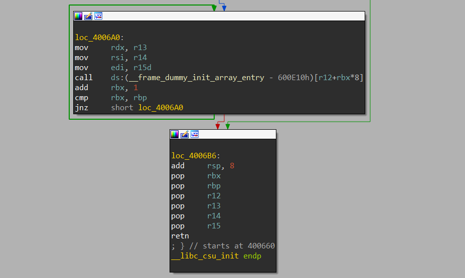
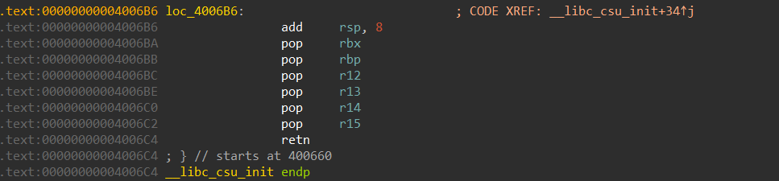
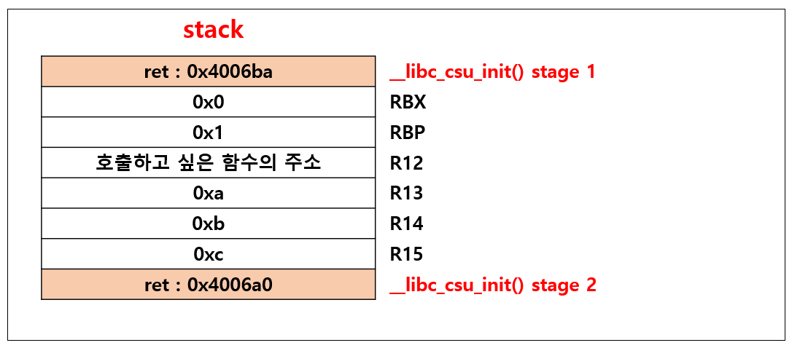
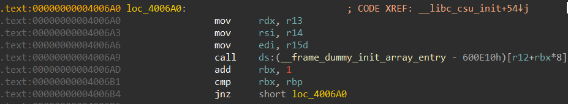

 # Return-to-Csu  
   
64bit 바이너리는 함수를 호출할 때 인자를 레지스터로 전달한다.   
이러한 특이점 때문에 흔히 볼 수 있는 문제가 gadget 부족이다.   
 

이러한 상황에서 사용할 수 있는 기법이 Return to Csu이다.   
 

## Return to Csu란?
   
위 사진을 보면 알 수 있듯이 __libc_csu_init()에서는 __init_array에 설정된 함수 포인터를 읽어서 호출하는 과정이 있는데 이 부분을 이용하여 rsi, rdi, rdx를 쉽게 구성할 수 있다.
 

## stage 1
stage1은 스택에 있는 값을 pop하여 레지스터에 값을 알맞게 세팅하는 작업이다.   
 

   
ret를 조작하여 __libc_csu_init()의 다음 루틴으로 이동했을 때 상황이다.   
그림을 보면 알 수 있듯이 ret를 조작하고 스택에 적절한 값을 넣어야한다.   
 

   
여기서 rbp를 0x1로 세팅하는 이유는 나중에 RTC Chaining을 하기 위해서이다.   
 

## stage 2 
stage1에서 값을 알맞게 세팅하면 stage2로 넘어오게 된다.   
 

   
call이 진행되기 전까지 r13,r14,r15에 있는 값은 rdx, rsi, rdi로 복사된다.   
그리고 마지막으로 call[r12 + rbx*0x8]을 수행하게 되는데 이는 결과적으로 r12에 들어있는 주소의 함수를 실행하게 된다.   
 

## RTC Chaining
stage2가 끝나고 add rbx,1 을 수행하게 되면 rbx는 1로 세팅되고 rbp는 1로 세팅되어 있으므로 stage1으로 이동하게 된다.   
그러면 한 번 더 RTC를 진행할 수 있다. 

